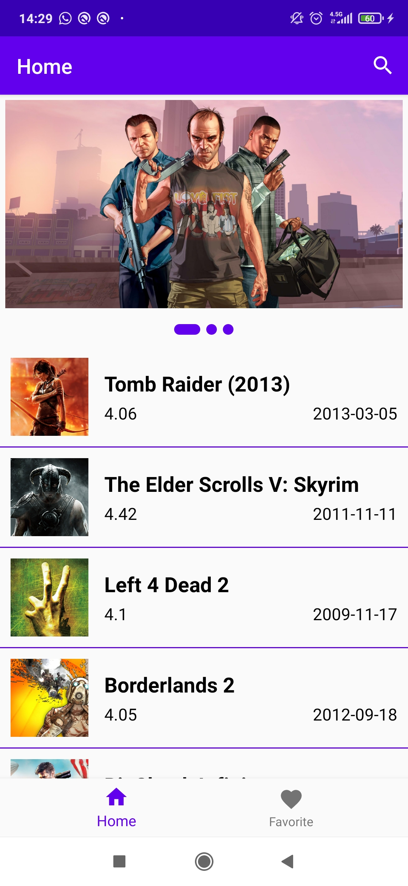
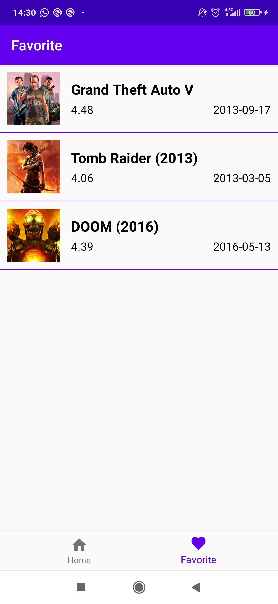

# HomeworkAppcent

This project is created for my job application.

|  |  |  |
|:-------------------------|:-------------------------|:-------------------------|

## What we have in the app?

- MVVM as a design pattern.

- Firebase integrations: Firebase Analytics, Crashlytics, Performance.

- Room as local database.

- Okhttp as Rest Api Client.
